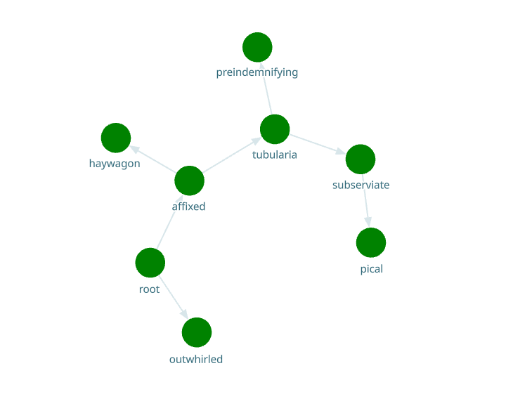
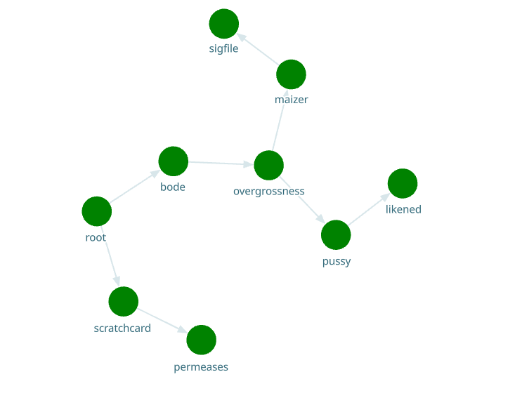

# топологические алгоритмы балансировки и распространения
## задача
эта работа -- лабораторная по предмету "теория и алгоритмы высокопроизводительных вычислений". суть работы -- реализовать балансировку с помощью алгоритма эха и алгоритма финна.
## о работе
в качестве предметной области выбрана эмуляция декодирования видео. каждый процесс имеет свою очередь задач и число процессоров. считается что задача нагружает ядро процессора на 100% пока не выполнится через `backend/config.json:task_time` секунд. 

Серверная структура имеет древовидную ориентированную форму и определена в `backend/topology.json` файле. при выполнении `backend/_generate_specs.py` структура меняется на другую, при том у серверов имена меняются на произвольные случайные слова (так что pussy в названиях серверов это просто совпадение). Пример ниже

Сервера реализованы на fastapi и запускаются с помощью orcestrator.py. реализован он коряво и иногда может оставлять после себя зомби, так что убить все мои процессы вы можете с помощью `backend/KILL EVERYBODY.sh`.

Сервера запускаются на портах `[8000-...)`

Кроме серверов также есть балансировщик и фронтенд. балансировщик запущен на порту 7999, фронтенд на 3000.

### Балансировщик 
лежит по пути `backend/balancer.py` и имеет следующие сценарии:
1. каждые `backend/config.json:rebalance_interval` секунд происходит балансировка всех серверов
    0. балансировщик прослушивает сокетные сообщения на ws://localhost:7999/ws
    1. балансировщик отправляет своему дочернему процессу на порту 8000 json вида `{route:'echo', sender:'ws://localhost:7999/ws'}`
    2. 8000 принимает сообщение и отправляет его своим потомкам
    3. бездетные потомки отправляют сообщение `{route:'echo_back'}` по адресу sender от родителя. при этом sender сохранено в контексте приложения ввиду асинхронности сокетов
    4. балансировщик получает всю информацию через сокет и вызывает балансировку
    5. балансировщик формирует мин-кучу с ключом `-(cpu/load)`, таким образом наверху оказываются самые загруженные процессы
    6. по одному балансировщик отправляет http реквесты rebalance на самые загруженные сервера, указывая получателя из тех серверов где самый большой ресурс (cpu-load)
    7. сервер, получая реквест rebalance, убирает элемент из очереди задач, понижает себе загрузку и увеличивает её у того, кто получил его задачу
        - реквест rebalance может вернуть ошибку, это нормально. это означает что задача уже выполнилась и нет нужды в перебалансировку
2. с помощью алгоритма финна по роуту `/finn_ws` происходит распределение нагрузки
    1. балансировщик принимает http реквест на адрес finn_ws
    2. балансировщик отправляет через сокет на корень 8000 json вида `{'route':'finn', 'inc': [], 'ninc':[]}`
    3. сервер получает этот пакет и отправляет дальше, добавляя в inc и ninc себя т.к. все родители отправили ему сообщение.
        - также он выполняет finn_action, т.к. его ninc == inc. finn_action -- функция, добавляющая 1 задачу
    4. аналогично работают другие сервера: получают inc и ninc, конкатенируют со своими. по умолчанию их inc -- `app.state.port`, ninc -- пустой set. если они получили сообщения от вс после того как они получают сообщения от всех родителей они добавляют себе в ninc свой порт и отправляют сообщения детям, а когда inc==ninc то выполняют finn_action.
3. с помощью алгоритма echo передают в фронтенд всю информацию о дереве серверов
    1. фронтенд (на порту 3000) подключается к сокету на 7999
    2. балансировщик регистрирует фронтенд и будет отправлять ему пакеты, в которых нет поля `purpose:'rebalance'` (т.к. это только для ребалансировки)
    3. раз в 5 секунд фронтенд делает http реквест на роут echo_ws балансировщика
    4. после реквеста из п. выше происходит такое же распространение как в сценарии балансировки
    5. после получения финального варианта строения дерева оно также отправляется в фронтенд и парсится в дерево. см. изображение ниже. иногда пакеты теряются и структура меняется, это не страшно

## стек
fastapi, websockets, react, pydantic, argparse, subprocess, threading, chroma-js, reagraph, treelib, random_word

## запуск
проверено на python3.12.3.
1. cd backend
2. pip install -r requirements.txt (желательно в venv)
    - опционально: python3 _generate_specs.py чтобы изменить топологию
3. python3 orcestrator.py
4. python3 balancer.py (в отдельном окне консоли)
5. cd ..
6. cd frontend
7. yarn
8. yarn start (в отдельном окне консоли)
9. после того как закончите можно почистить систему от зомби, выполнив  sh 'backend/KILL EVERYBODY.sh', но на свой страх и риск
## алгоритм эха и балансировка

## алгоритм финна и распространение